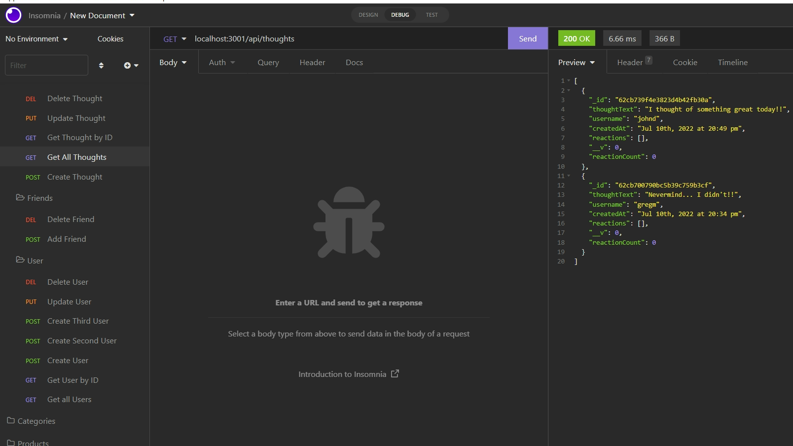

# Social Network API

## Table-of-Contents

- [Description](#description)
- [Installation](#installation)
- [Usage](#usage)
- [Contributing](#contributing)
- [Tests](#tests)
- [License](#license)
- [Questions](#questions)

## [Description](#table-of-contents)

This application serves as the backend for a social network application. It allows users to add friends, share thoughts and react to the thoughts of other users. This application utilizes MongoDB, Mongoose, Express, Node, and Nodemon. 

## [Installation](#table-of-contents)

A user must clone this repository and make sure they have installed Node.js on their computer. Once cloned and installed, the user will be required to install Mongoose, Express and Nodemon by typing `npm install` in their terminal. 

## [Usage](#table-of-contents)

From the command line in the terminal, a user can type `node server` to run the social network API. Insomnia was utilized in the development of this application to test routes and the database. 

### **Click on the following link to view the video demonstration on Insomnia:**
https://drive.google.com/file/d/1iSFFn87p35hYdGIoHXdUPHteU2iaXDsZ/view

### **Screenshot of the Social Network API from Insomnia:**

## [Contributing](#table-of-contents)

Contributors can see installation instructions or contact me with the information below.

## [Tests](#table-of-contents)

There are no tests for this application.

## [License](#table-of-contents)

## [Questions](#table-of-contents)

If you have any questions about this project, please contact me using the following links:

[GitHub](https://github.com/Gregm316)

[Email: gregm316@gmail.com](mailto:gregm316@gmail.com)
